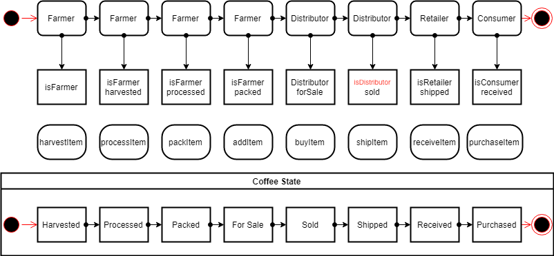

# Project 6B Supply Chain

## Truffle Version
>
    Truffle v5.3.7 (core: 5.3.7)
>

## Node Version
>
    node v15.0.1
>

## web3 Version
>
    web3@1.0.0-beta.37
>

## Transaction ID
>
    0x106d8195e3109c7e5ff4bec3b4fdd83a660eacd1425f2c89a6ccf718b10820e2
>
## Contract Address
>
    0x0ECbA3f03Df1aa6cA01915cb377107Be8d458Ab6
>

## Requirement 1: Project write-up - UML

### Activity Diagram

### Sequence Diagram

### State Diagram

### Class Diagram (Data Model)

## Requirement 2: Project write-up - Libraries
I used one library called Roles which made it easier to manage AccessControl in my DAPP. It made it easy to add and remove roles in each of my AccessControl contracts (FarmerRole.sol, DistributorRole.sol, RetailerRole.sol, and ConsumerRole.sol).

## Requirement 3: Project write-up - IPFS
I did not use IPFS to deliver my website for this project. However, I could have added my HTML, CSS, and JS files to IPFS in order to fully decentralize my Supply Chain DAPP.

## Getting Started

These instructions will get you a copy of the project up and running on your local machine for development and testing purposes. See deployment for notes on how to deploy the project on a live system.

### Prerequisites

### Installing
Please make sure you've already installed ganache-cli, Truffle and enabled MetaMask extension in your browser.

Installing
A step by step series of examples that tell you have to get a development env running

>
    cd project-6
    npm install
>

Launch Ganache:

ganache-cli -m "spirit supply whale amount human item harsh scare congress discover talent hamster"
In a separate terminal window, Compile smart contracts:
>
    truffle compile
>

This will create the smart contract artifacts in folder build\contracts.

Migrate smart contracts to the locally running blockchain, ganache-cli:
>
    truffle migrate
>

Test smart contracts:
>
    truffle test
>
All 10 tests should pass.

In a separate terminal window, launch the DApp:
>
    npm run dev
>